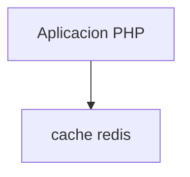

# Observaciones al proyecto
Lo siguiente son datos de interés en relación al desarrollo del proyecto. 
## dominios
Para simular el funcionamiento de los dominios alojados en la aplicacion (conejox, cerdas y babosas), dado que el desarrollo
es con un docker que hace las veces de servidor, he necesitado editar mi /etc/hosts y añadir lo siguiente:

    127.0.0.1	localhost conejox.com cerdas.com babosas.biz vivoras.com

He añadido el dominio `vivoras.com` para, dado que no existe alojado en la aplicacion, muestre un mensaje de error.
## thumbnails
En la documentación de la práctica se indica que hay 5 thumbnails y su uso. Sin embargo, en los datos que se reciben de 
la url indicada, solo se encuentran del 1 al 4. No se que puede indicarse del 5º thumbnail (¿quizás es un error de doc?) 
## información de la pagina web
la información que nos llega de la url contiene bastantes datos. No he modelado todos, solo aquellos de los que he visto
una utilidad más cercana. Si necesitáramos mas información, tendriamos que añadir el `valueObject` correspondiente, agregarlo
en el objeto `Girl`, y luego en el servicio `arrayToGirls`

## css de front
He revisado los archivos de css de cada proyecto, y dado que son similares, he optado por separar el css común en un archivo
`base.css`, y luego cada uno de los sites tiene su propio archivo. Este archivo se encuentra dentro de la información del archivo
de configuracion de symfony, en la seccion `parameters`. 

Como mejora, se podria incluir un sistema tipo scss, que compilara en un único archivo css los tres que se necesitan.
También habria que revisar todo el css. Quizás se pueda simplificar utilizando un bootstrap o rehaciendo todo desde 0. Esto
último no he optado por ello, porque no me veo actualmente capacitado para temas de frontend/css.

## link emergente
Para ver la pantalla de registro de la webcam, me resultaba mas comodo utilizar bootstrap. Esto hace que cargue un poco mas
la web (habria que optimizarlo). El contenido de la url de la webcam se carga dentro del marco central del modal.

## Url de imagenes
Aunque la información que nos llega de la petición de la url contiene entre otros los thumbnail de cada camara, los datos
solo contienen el nombre del archivo de imagen. No he sido capaz haciendo pruebas con la informacion indicada de ver dicha imagen.
Por ello, he optado por añadir imagenes aleatorias en cada representación de la pagina.

Las imágenes que he elegido son de comic manga. 

## benchmark e infraestructura
La infraestructura que utiliza la aplicación es un docker con la aplicación, que ejecuta la aplicacion con PHP como servidor directamente.
No utilizamos apache-fpm, o nginx.

La primera prueba de aproximación para ver el rendimiento de la aplicación, ha sido utilizar el comando `ab` de apache,
que nos permite hacer pruebas de benchmark sobre la url. 
El comando a utilizar es:

    ab -n 1000 -c 10 http://{dominio.tld}/

Dado que la aplicación responde a cada uno de los dominios, doy por supuesto que la petición de cada web será muy parecida.
En este caso, he utilizado como dominio `cerdas.com`.

El resultado del benchmark ha sido:

```
Server Software:        
Server Hostname:        cerdas.com
Server Port:            80

Document Path:          /
Document Length:        31938 bytes

Concurrency Level:      10
Time taken for tests:   4243.917 seconds
Complete requests:      1000
Total transferred:      32211478 bytes
HTML transferred:       31918478 bytes
Requests per second:    0.24 [#/sec] (mean)
Time per request:       42439.173 [ms] (mean)
Time per request:       4243.917 [ms] (mean, across all concurrent requests)
Transfer rate:          7.41 [Kbytes/sec] received

Connection Times (ms)
              min  mean[+/-sd] median   max
Connect:        0    0   0.0      0       0
Processing:  4206 42211 2560.6  42385   43650
Waiting:     4206 42210 2560.6  42385   43650
Total:       4206 42211 2560.6  42385   43650

Percentage of the requests served within a certain time (ms)
  50%  42385
  66%  42455
  75%  42509
  80%  42556
  90%  42680
  95%  42816
  98%  42942
  99%  43158
 100%  43650 (longest request)
```
se puede observar un benchmark bastante malo en el commit #####

En una siguiente fase, cambiamos la infraestructura,y vamos a añadir un servidor redis. En dicho servidor vamos a guardar
en cache durante 15 min (segun doc) los resultados de la llamada a la web.

Una vez añadido el servicio en docker, y cambiado el repositorio `CumlouderGirlRepository`, procedemos a hacer el mismo
comando. El resultado es muy interesante:

```
Server Software:        
Server Hostname:        cerdas.com
Server Port:            80

Document Path:          /
Document Length:        31736 bytes

Concurrency Level:      10
Time taken for tests:   7.166 seconds
Complete requests:      1000
Total transferred:      32127196 bytes
HTML transferred:       31834196 bytes
Requests per second:    139.55 [#/sec] (mean)
Time per request:       71.657 [ms] (mean)
Time per request:       7.166 [ms] (mean, across all concurrent requests)
Transfer rate:          4378.40 [Kbytes/sec] received

Connection Times (ms)
              min  mean[+/-sd] median   max
Connect:        0    0   0.0      0       0
Processing:     4   33 134.5     29    4280
Waiting:        4   33 134.5     29    4280
Total:          4   33 134.5     29    4281

Percentage of the requests served within a certain time (ms)
  50%     29
  66%     29
  75%     29
  80%     29
  90%     29
  95%     30
  98%     30
  99%     31
 100%   4281 (longest request)
```
Se pueden ver bastantes mejoras:

|     | sin redis  | con redis |
|-----|------------|-----------|
| Requests per second |  0.24          | 139.55    | | |
| Time per request |   42439.173         | 71.657    | | |
| Transfer rate | 7.41 |   4378.40        |

# Infraestructura
En el proyecto disponemos de dos servicios docker:

    aplicacion PHP (app)
    servidor Redis (redis)

